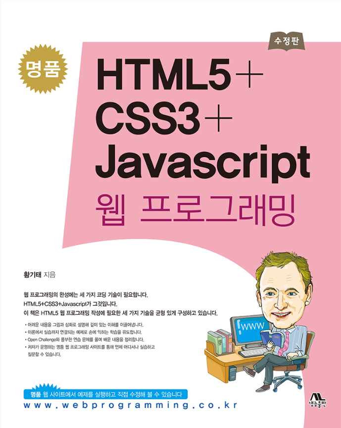

# Web-Programming-Solution
<b>명품 HTML5 + CSS3 + Javascript 웹 프로그래밍</b> 책의 예제들에 대한 솔루션입니다. 

<a href="https://github.com/jin519/WebProgramming-Solution/tree/master/ch01">chapter 01 - 웹 프로그래밍과 HTML5 개요</a> 
<a href="https://github.com/jin519/WebProgramming-Solution/tree/master/ch02">chapter 02 - HTML5 기본 문서 만들기</a> 
<a href="https://github.com/jin519/WebProgramming-Solution/tree/master/ch03">chapter 03 - HTML5 문서 구조화와 웹 폼</a> 
<a href="https://github.com/jin519/WebProgramming-Solution/tree/master/ch04">chapter 04 - CSS3로 웹 페이지 꾸미기</a> 
<a href="https://github.com/jin519/WebProgramming-Solution/tree/master/ch05">chapter 05 - CSS3 고급 활용</a> 
<a href="https://github.com/jin519/WebProgramming-Solution/tree/master/ch06">chapter 06 - 자바스크립트 언어</a> 
<a href="https://github.com/jin519/WebProgramming-Solution/tree/master/ch07">chapter 07 - 자바스크립트 코어 객체와 배열</a> 
<a href="https://github.com/jin519/WebProgramming-Solution/tree/master/ch08">chapter 08 - HTML DOM과 Document</a> 
<a href="https://github.com/jin519/WebProgramming-Solution/tree/master/ch09">chapter 09 - 이벤트 기초 및 활용</a> 
<a href="https://github.com/jin519/WebProgramming-Solution/tree/master/ch10">chapter 10 - 윈도우와 브라우저 관련 객체</a> 
